

# ImageSegComp
Comparison of several models for image segmentation (meant to evolve)

<!-- TABLE OF CONTENTS -->

  
Table of Contents

  <ol>
    <li>
      <a href="#about-this-project">About This Project</a>
      <ul>
        <li><a href="#using">Using</a></li>
      </ul>
	  <ul>
        <li><a href="#dataset-used">Dataset Used</a></li>
      </ul>
    </li>
    <li><a href="#roadmap">Roadmap</a></li>
	<li><a href="#unet">UNet</a></li>
		<li>
			<a href="#unet-presentation">Unet Presentation</a>
			<ul>
			<li><a href="#unet-trainning">Unet Trainning</a></li>
			</ul>
			<ul>
			<li><a href="#unet-results-&-inference">Unet Results & Inference</a></li>
			</ul>
		</li>
    <li><a href="#contact">Contact</a></li>
    <li><a href="#references">references</a></li>
  </ol>

<!-- ABOUT THIS PROJECT -->
## About This Project
In deep learning, Image segmentation is a computer vision technique that partitions a digital image into discrete groups of pixels.
The core task of image segmentation is to classify each pixel in an image.

There are 3 types of image segmentation:

* Semantic segmentation classifies each pixel based on its semantic class. All the birds belong to the same class.
* Instance segmentation assigns unique labels to different instances, even if they are of the same semantic class. Each bird belongs to a different class.
* Panoptic segmentation combines the two, providing both class-level and instance-level labels. Each bird has its own class, but they are all identified as a “bird”.

Here, we will only focus on 'basic' semantic segmentation.

The main goal of this project is purely personnal, and is not a reasearch project in any shape or form. 
I just want to test, train, and try different architecture for image segmentation tasks, 
starting with the first of its kind, the UNet architecture.

<!-- USING -->
### Using
* [Pytorch](https://pytorch.org/)
* [MLFlow](https://mlflow.org/)
* [pytorch_lightning](https://lightning.ai/docs/pytorch/stable/) (for segformer)
* All our images are 512/512

<!-- DATASET USED -->
### Dataset Used
To be able to compare our models, we will use the [Cityscape Dataset](https://www.cityscapes-dataset.com/).
It's one of the most popular dataset used to compare model for this kind of task, along others, like COCO dataset and ADE20K. 
Cityscape's main content is dashboard camera images in Germany streets, just like images used for car autonomous AI.

Originally, Cityscape contains 34 differents segmentation classes, wich i reduced to 8 main categories:
* Void
* Flat
* Construction
* Object
* Nature
* Sky
* Human
* Vehicle

The Dataset I use contains 3,475 images. After split, the distribution is the following:
* 2953 images for trainning
* 261 images for validation
* 261 images for testing

I have not planned yet to use any augmentation for this project.

For more information about augmentations, [check this](https://albumentations.ai/docs/introduction/image_augmentation/).

<!-- ROADMAP -->
## Roadmap
- [x] UNet
- [x] Segformer (mit-b3)
- [ ] Use MLFlow
- [ ] Segment Anything (Meta) ?

<!-- UNET -->
# UNet
#### Unet Presentation
The [U-Net](https://arxiv.org/abs/1505.04597) architecture was initially designed for medical image segmentation, but it has since been adapted for many other use cases.

The U-Net has an encoder-decoder structure.

The encoder is used to compress the input image into a latent space representation through convolutions and downsampling.

The decoder is used to extrapolate the latent representation into a segmented image, through convolutions and upsampling.

The long gray arrows running across the “U” are skip connections, and they serve two main purposes:
* During the forward pass, they enable the decoder to access information from the encoder.
* During the backward pass, they act as a “gradient superhighway” for gradients from the decoder to flow to the encoder.

The output of the model has the same width and height as the input, however the number of channels will be equal to the number of classes we are segmenting (8).

#### Unet Trainning
For 20 epochs, with a patience of 3. Using AdamW optimizer and a learning rate of 10-3
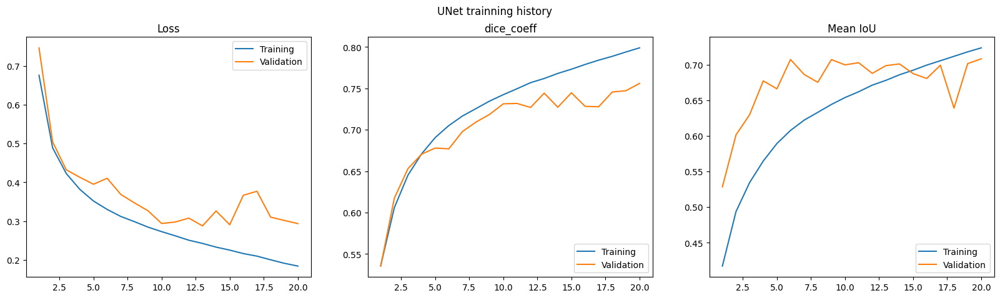
Unet could be more trainned, we probably could achieve better results with augmentation.

#### Unet Results & Inference
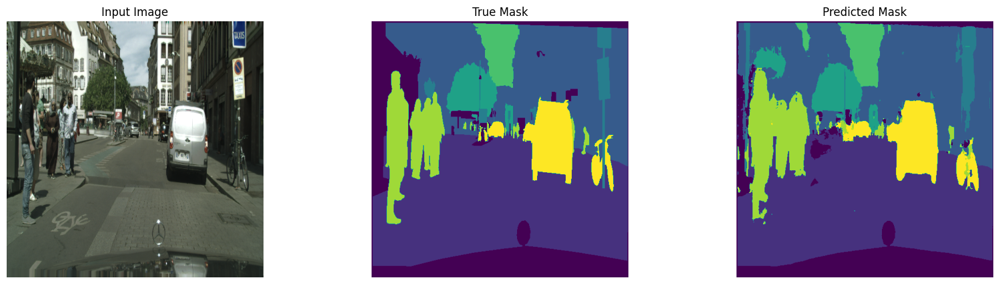
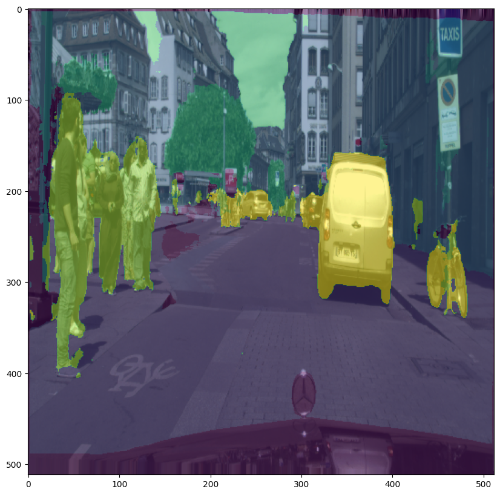

Results are already satisfaying, but we do have some categories that drool on others.

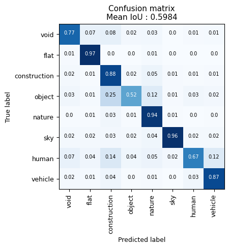
In thos condition, Unet is a little bit struggling to recognize humans. 
Sometimes mistaking them for classes that are behind them.
Also struggling on objects 50% of the time.

# SegFormer
#### Vision Transformers - ViT
SegFormer implementation rely on multiple previous researchs. Back in 2021, a Google Research team published a paper 
'[AN IMAGE IS WORTH 16X16 WORDS: TRANSFORMERS FOR IMAGE RECOGNITION AT SCALE](https://arxiv.org/pdf/2010.11929)'.
This paper illustrate the fact that it is possible to realize image segmentation without the uses of convolution, implementing a model, ViT, 
relying only on Transformers-Self-attention-based architectures, only used in NLP and LLM until then, to make pixel predictions.
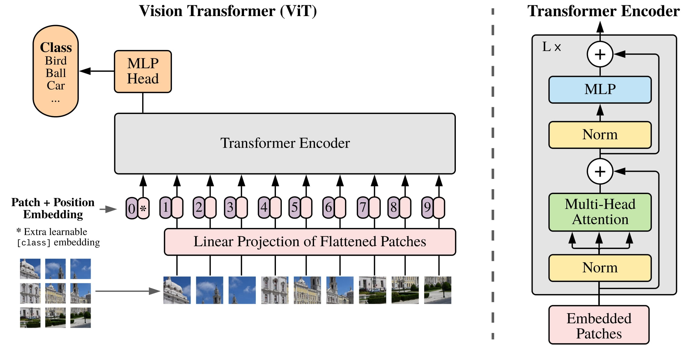
The main idea is to cut the images in 'patches', multiple patches make a sequence, using self attention between those patches made segmentation possible.

The abstract from the paper is the following:
" While the Transformer architecture has become the de-facto standard for natural language processing tasks, 
its applications to computer vision remain limited. In vision, attention is either applied in conjunction with convolutional networks, 
or used to replace certain components of convolutional networks while keeping their overall structure in place. 
We show that this reliance on CNNs is not necessary and a pure transformer applied directly to sequences of image 
patches can perform very well on image classification tasks. When pre-trained on large amounts of data and transferred to 
multiple mid-sized or small image recognition benchmarks (ImageNet, CIFAR-100, VTAB, etc.), 
Vision Transformer (ViT) attains excellent results compared to state-of-the-art convolutional networks while requiring 
substantially fewer computational resources to train."

Multiple research where then based on this paper to enhance the usage of Transformers in image segmentation. Introducing : SegFormer.

#### SegFormer Presentation
The SegFormer model was proposed in: [Simple and Efficient Design for Semantic Segmentation with Transformers](https://arxiv.org/pdf/2105.15203)
The model consists of a hierarchical Transformer encoder and a lightweight all-MLP decode head to achieve great results on image segmentation benchmarks.

The “hierarchical Transformer” refers to a transformer architecture that operates on multiple scales or resolutions of the input sequence.
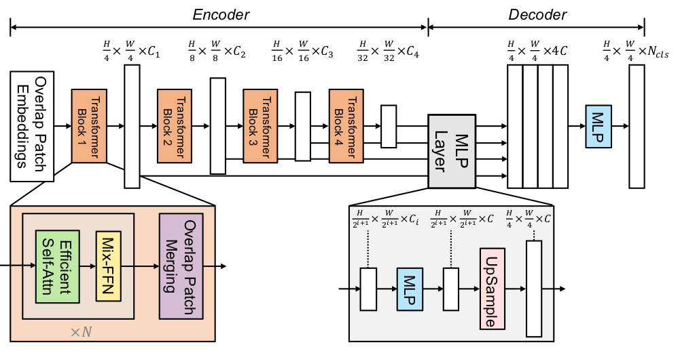

The model exists at different scale :
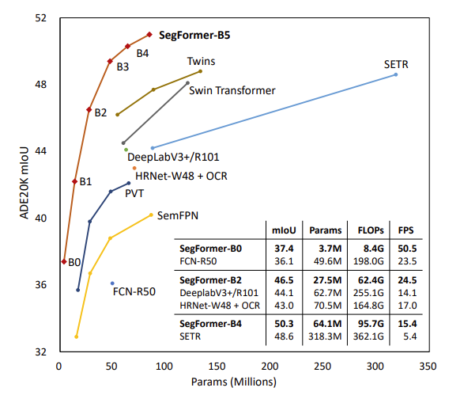

We are using the mit-b3 version of segformer, whose encoder has been pre-trainned on the ImageNet-1k dataset.

#### SegFormer Trainning
For 20 epochs, with a patience of 3. Using AdamW optimizer and a learning rate of 10-3
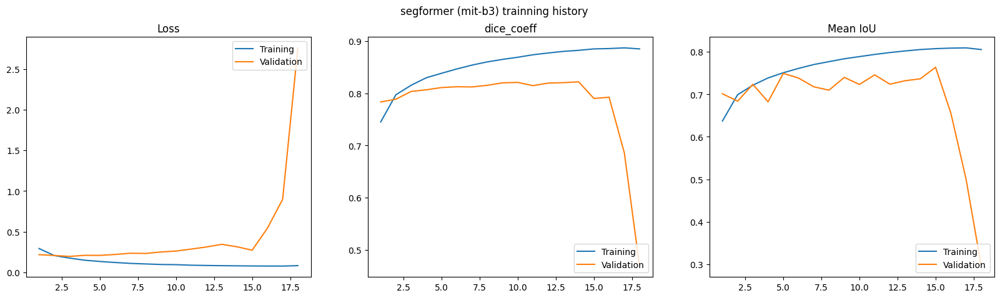
For yet unknow reasons, validation suddenly drops around the 18th epoch.

#### SegFormer Results & Inference
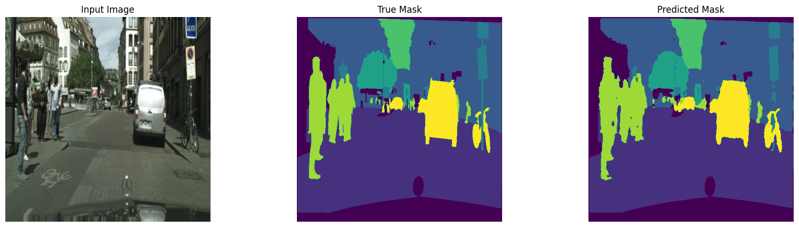
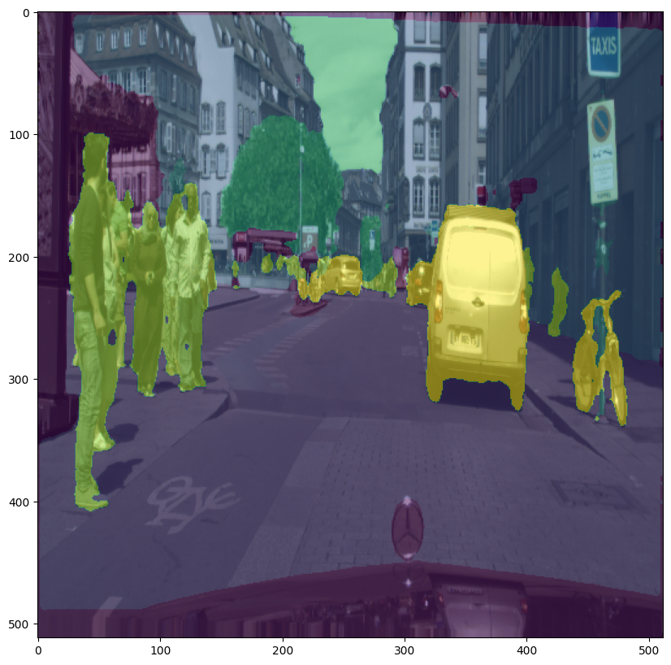

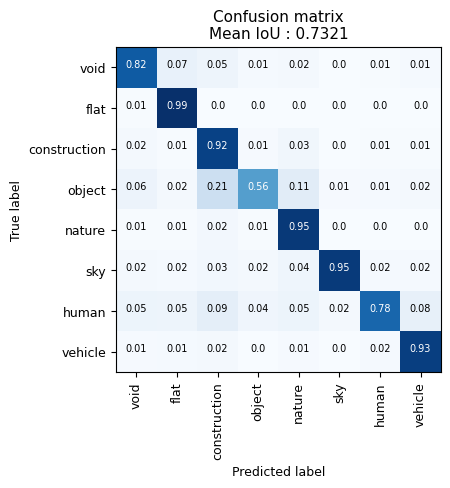
Also struggling on objects 50% of the time.

# References