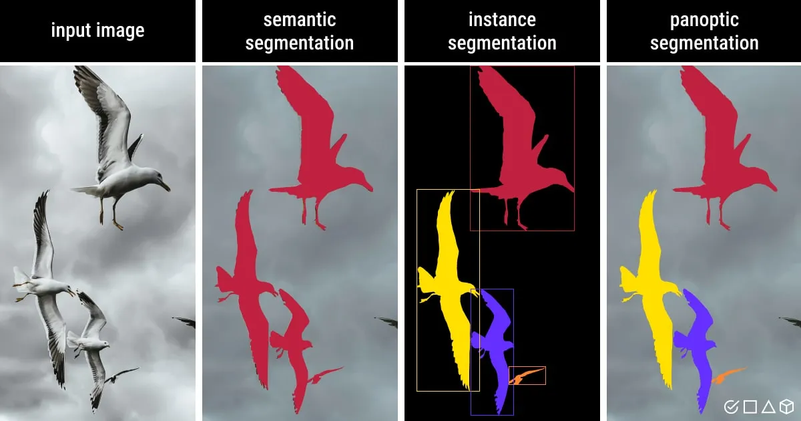
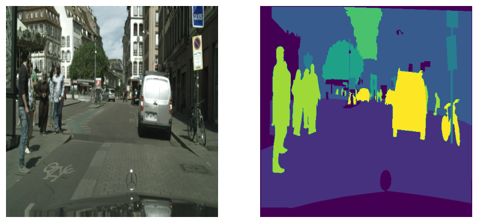
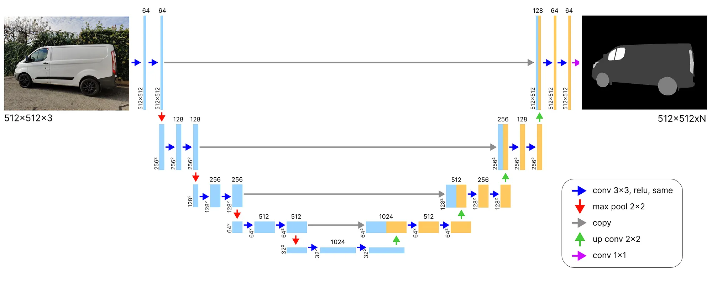

# ImageSegComp
Comparison of several models for image segmentation (meant to evolve)

<!-- TABLE OF CONTENTS -->

  
Table of Contents

  <ol>
    <li>
      <a href="#about-this-project">About This Project</a>
      <ul>
        <li><a href="#using">Using</a></li>
      </ul>
	  <ul>
        <li><a href="#dataset-used">Dataset Used</a></li>
      </ul>
    </li>
    <li><a href="#roadmap">Roadmap</a></li>
    <li><a href="#contact">Contact</a></li>
    <li><a href="#acknowledgments">Acknowledgments</a></li>
  </ol>

<!-- ABOUT THIS PROJECT -->
## About This Project
In deep learning, Image segmentation is a computer vision technique that partitions a digital image into discrete groups of pixels.
The core task of image segmentation is to classify each pixel in an image.

There are 3 types of image segmentation:

* Semantic segmentation classifies each pixel based on its semantic class. All the birds belong to the same class.
* Instance segmentation assigns unique labels to different instances, even if they are of the same semantic class. Each bird belongs to a different class.
* Panoptic segmentation combines the two, providing both class-level and instance-level labels. Each bird has its own class, but they are all identified as a “bird”.

Here, we will only focus on 'basic' semantic segmentation.

The main goal of this project is purely personnal, and is not a reasearch project in any shape or form. 
I just want to test, train, and try different architecture for image segmentation tasks, 
starting with the first of its kind, the UNet architecture.

<!-- USING -->
### Using
* [Pytorch](https://pytorch.org/)
* [MLFlow](https://mlflow.org/)
* [pytorch_lightning](https://lightning.ai/docs/pytorch/stable/) (for segformer)

<!-- DATASET USED -->
### Dataset Used
To be able to compare our models, we will use the [Cityscape Dataset](https://www.cityscapes-dataset.com/).
It's one of the most popular dataset used to compare model for this kind of task, along others, like COCO dataset and ADE20K. 
Cityscape's main content is dashboard camera images in Germany streets, just like images used for car autonomous AI.

Originally, Cityscape contains 34 differents segmentation classes, wich i reduced to 8 main categories:
* Void
* Flat
* Construction
* Object
* Nature
* Sky
* Human
* Vehicle

The Dataset I use contains 3,475 images. After split, the distribution is the following:
* 2953 images for trainning
* 261 images for validation
* 261 images for testing

I have not planned yet to use any augmentation for this project.

For more information about augmentations, [check this](https://albumentations.ai/docs/introduction/image_augmentation/).

<!-- ROADMAP -->
## Roadmap
- [x] UNet
- [x] Segformer (mit-b3)
- [ ] Use MLFlow
- [ ] Segment Anything (Meta) ?

# UNet
#### Presentation
The [U-Net](https://arxiv.org/abs/1505.04597) architecture was initially designed for medical image segmentation, but it has since been adapted for many other use cases.

The U-Net has an encoder-decoder structure.

The encoder is used to compress the input image into a latent space representation through convolutions and downsampling.

The decoder is used to extrapolate the latent representation into a segmented image, through convolutions and upsampling.

The long gray arrows running across the “U” are skip connections, and they serve two main purposes:
* During the forward pass, they enable the decoder to access information from the encoder.
* During the backward pass, they act as a “gradient superhighway” for gradients from the decoder to flow to the encoder.

The output of the model has the same width and height as the input, however the number of channels will be equal to the number of classes we are segmenting.

# SegFormer